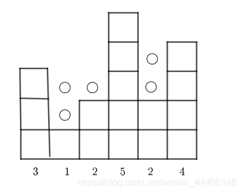

# 容器盛水问题

## 题目描述

给定一个整形数组```arr```，已知其中所有的值都是非负的，将这个数组看作一个容器，请返回容器能装多少水。

### 示例1

**输入**
```
[3, 1, 2, 5, 2, 4]
```
**返回值**
```
5
```
### 示例2

**输入**
```
[4, 5, 1, 3, 2]
```
**返回值**
```
2
```

**说明**

数组长度 $\leq 10^6$ 

**备注**

$1 \leq N \leq 10^6$

## 解释说明



首先，通过观察题目可以看出，左侧单调递增和右侧单调递减时，是无法组成容器的。因此，我们可以从两侧逐渐向中间进行挤压。

```C++
class Solution {
public:
    /**
     * max water
     * @param arr int整型vector the array
     * @return long长整型
     */
    long long maxWater(vector<int>& arr) {
        // write code here
        if (arr.size() < 3){
            return 0;
        }
        int left = 0, right = arr.size() - 1;
        int lLevel = arr[left], rLevel = arr[right];
        long long ans = 0;
        while (left < right){
            if (arr[left] < arr[right]){
                left++;
                if (lLevel < arr[left]){
                    lLevel = arr[left];
                    continue;
                }
                ans += lLevel - arr[left];
            }else{
                right--;
                if (rLevel < arr[right]){
                    rLevel = arr[right];
                    continue;
                }
                ans += rLevel - arr[right];
            }
        }
        return ans;
    }
};
```