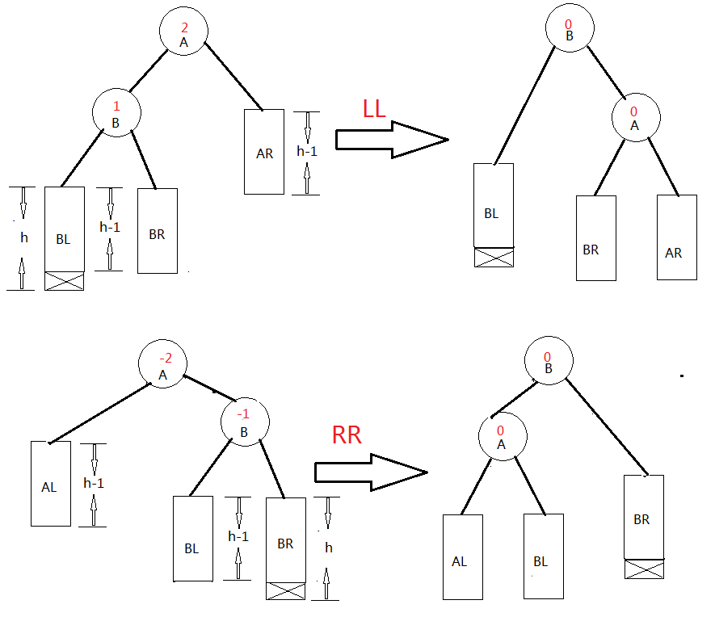
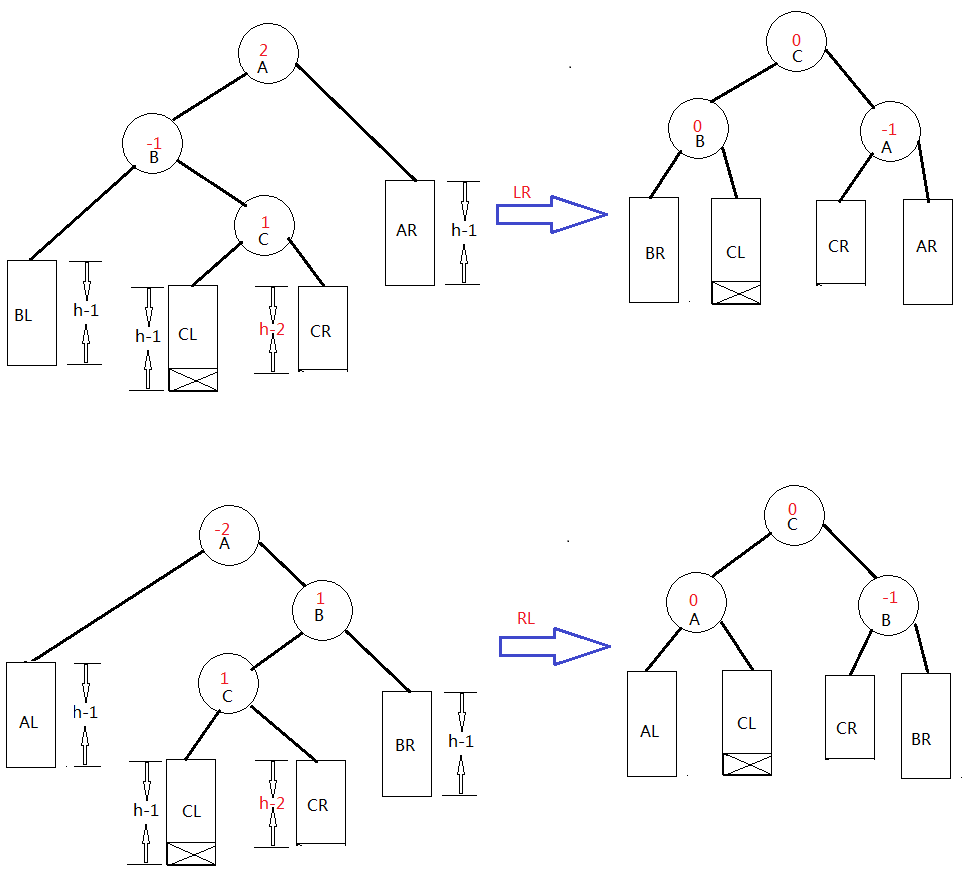
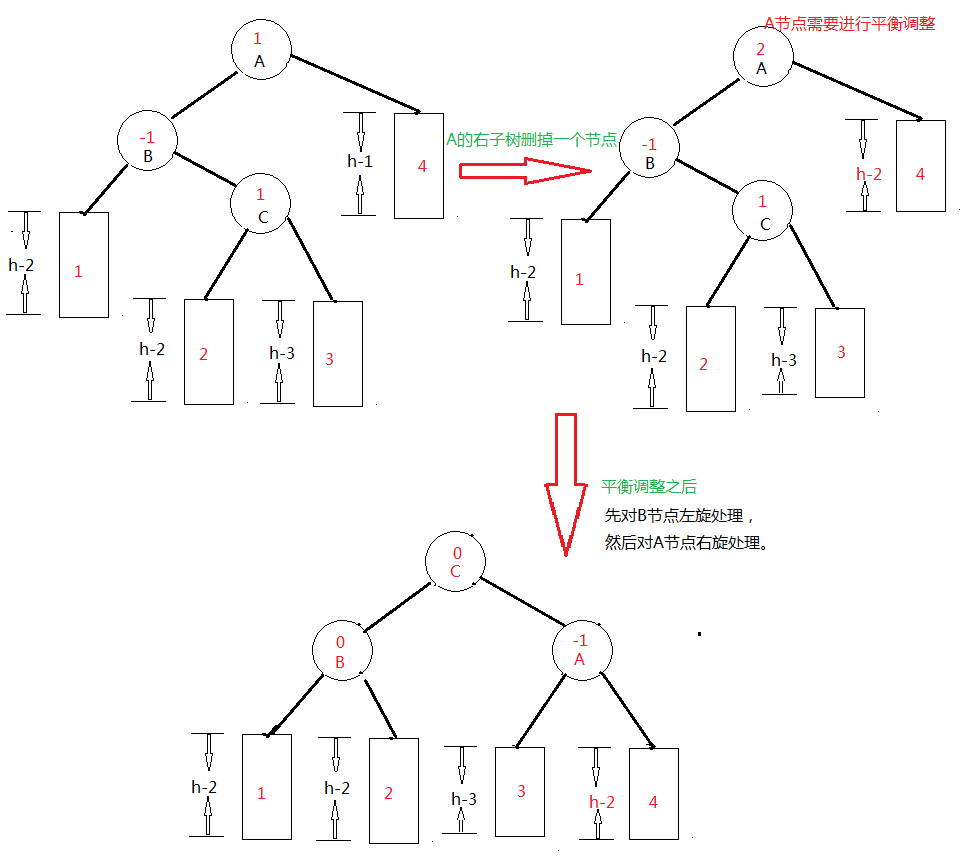

# 平衡二叉树插入和删除

## AVL树

平衡二叉树(Balancedbinary tree)是由阿德尔森-维尔斯和兰迪斯(Adelson-Velskiiand Landis)于1962年首先提出的，所以又称为AVL树。

定义：平衡二叉树或为空树,或为如下性质的二叉排序树:

- 左右子树深度之差的绝对值不超过1;
- 左右子树仍然为平衡二叉树.

平衡二叉树可以避免排序二叉树深度上的极度恶化，使树的高度维持在O（logn）来提高检索效率。

## 插入操作

因为插入节点导致整个二叉树失去平衡分成如下的四种情况：





假设由于在二叉排序树上插入节点而失去平衡的最小子树根节点的指针为```a```（即```a```是离插入节点最近，且平衡因子绝对值超过1的祖先节点），则失去平衡后进行调整的规律如下：

- 如上图LL单向右旋处理：由于在```a```的左子树根节点的左子树上插入节点，```a```的平衡因子由$1$增至$2$，致使以```a```为根节点的子树失去平衡，则需要进行一次向右的顺时针旋转操作。
- 如上图RR单向左旋处理：由于在```a```的右子树根节点的右子树上插入节点， ```a```的平衡因子有$-1$变为$-2$，致使以```a```为根节点的子树失去平衡，则需要进行一次向左的逆时针旋转操作。
- 如上图LR双向旋转（先左后右）处理：由于在```a```的左子树根节点的右子树插入节点，```a```的平衡因子由$1$增至$2$，致使以```a```为根节点的子树失去平衡，则需要进行两次旋转（先左旋后右旋）操作。
- 如上图RL双向旋转（先右后左）处理：由于在```a```的右子树根节点的左子树上插入节点，```a```的平衡因子由$-1$变为$-2$，致使以```a```为根节点的子树失去平衡，则需要进行两次旋转（先左旋后右旋）操作。

## 删除操作

对于二叉平衡树的删除采用的是二叉排序树删除的思路:

假设被删结点是```p```，其双亲是```f```，不失一般性，设```p```是```f```的左孩子，下面分三种情况讨论：
- 若结点```p```是叶子结点，则只需修改其双亲结点```f```的指针即可。
- 若结点```p```只有左子树```PL```或者只有右子树```PR```，则只要使```PL```或```PR```成为其双亲结点的左子树即可。
- 若结点```p```的左、右子树均非空，先找到```p```的中序前趋结点```s```（注意```s```是```p```的左子树中的最右下的结点，它的右链域为空），然后有两种做法：
  - 令```p```的左子树直接链到```p```的双亲结点```f```的左链上,而```p```的右子树链到```p```的中序前趋结点```s```的右链上。
  - 以```p```的中序前趋结点```s```代替```p```（即把```s```的数据复制到```p```中），将```s```的左子树链到```s```的双亲结点```q```的左（或右）链上。



```C++

#define EH 0
#define LH -1
#define RH 1

template <typename ElemType>
struct BSTNode {
	ElemType val;
	BSTNode* left = nullptr, * right = nullptr;
	int bf;
	BSTNode(ElemType v) {
		val = v;
		left = right = nullptr;
		bf = EH;
	}

	BSTNode(BSTNode& node) {
		val = node.val;
		left = node.left;
		right = node.right;
		bf = node.bf;
	}
};

template <typename ElemType>
class AVL {
private:
	BSTNode<ElemType>* root = nullptr;
	void rotateT(BSTNode<ElemType>*& root, int x);		//子树的左旋或者右旋
	void leftBalance(BSTNode<ElemType>*& root);
	void rightBalance(BSTNode<ElemType>*& root);
	bool insertNode(BSTNode<ElemType>*& root, ElemType val, bool& taller);
	bool deleteNode(BSTNode<ElemType>*& root, ElemType val, bool& shorter);
	void __deleteNode__(BSTNode<ElemType>* T, BSTNode<ElemType>*& s, BSTNode<ElemType>* p, bool flag, bool& shorter);
	void leftBalance_del(BSTNode<ElemType>*& root);
	void rightBalance_del(BSTNode<ElemType>*& root);
public:
	AVL() {
		root = nullptr;
	}
	bool insert(ElemType val);
	bool remove(ElemType val);
};

template <typename ElemType>
bool AVL<ElemType>::insert(ElemType val) {
	BSTNode* cur = new BSTNode(val);
	if (!root) {
		root = cur;
		return true;
	}
	bool taller = false;
	return insertNode(root, val, taller);
}

template <typename ElemType>
bool AVL<ElemType>::remove(ElemType val) {
	bool shorter = false;
	return delete(root, val, shorter);
}

template <typename ElemType>
bool AVL<ElemType>::deleteNode(BSTNode<ElemType>*& root, ElemType val, bool& shorter) {
	if (root->val == val) {
		BSTNode<ElemType>* q = nullptr, * s = nullptr;
		if (!root->right) { // 右子树为空，然后重接其左子树
			q = root;
			root = root->left;
			shorter = true; // 树变矮了 
			delete q;
			return true;
		}
		if (!root->left) {  // 左子树为空，重接其右子树
			q = root;
			root = root->right;
			shorter = true; // 树变矮了
			delete q;
			return true;
		}
        // 左右子树都非空 ，也就是第三种情况 
		__deleteNode__(root, root, nullptr, true, shorter);
		shorter = true;
		return true;
	}
	if (root->val > val) {  // 左子树 
		deleteNode(root->left, val, shorter);
		if (shorter) {
			switch (root->bf)
			{
			case LH:
				root->bf = EH;
				shorter = true;
				break;
			case EH:
				root->bf = RH;
				shorter = false;
				break;
			case RH:

				rightBalance_del(root);
				root->bf = EH;
				shorter = false;
				break;
			}
		}
		return true;
	}

	if (root->val < val) {  // 右子树 
		deleteNode(root->right, val, shorter);
		if (shorter) {
			switch (root->bf) {
			case LH:
				leftBalance_del(root);
				shorter = false;
				break;
			case RH:
				T->bf = EH;
				shorter = true;
				break;
			case EH:
				T->bf = LH;
				shorter = false;
				break;
			}
		}
	}
	return;
}

template <typename ElemType>
void AVL<ElemType>::__deleteNode__(BSTNode<ElemType>* root, BSTNode<ElemType>*& s, BSTNode<ElemType>* p, bool flag, bool& shorter) {
	if (flag) {
		flag = false;
		__deleteNode__(root, s->left, s, flag, shorter);
		if (shorter) {
			switch (s->bf)
			{
			case LH:
				s->bf = EH;
				shorter = true;
				break;
			case EH:
				s->bf = RH;
				shorter = false;
				break;
			case RH:
				rightBalance_del(s);
				shorter = false;
				break;
			}
		}
		return;
	}

	if (s->right == nullptr) {
		root->data = s->data;
		BSTNode<ElemType>* ss = s;
		if (p != root) {
			p->right = s->left;
		}
		else {
			p->left = s->left;
		}
		delete ss;
		shorter = true;
		return;
	}

	__deleteNode__(root, s->right, s, flag, shorter);
	if (shorter) {
		switch (s->bf) 
		{
		case LH:
			leftBalance_del(s);
			shorter = false;
			break;
		case EH:
			s->bf = LH;
			shorter = true;
			break;
		case RH:
			s->bf = EH;
			shorter = false;
			break;
		}
	}
}

template <typename ElemType>
void AVL<ElemType>::leftBalance_del(BSTNode<ElemType>*& root) {
	BSTNode<ElemType>* lChild = root->left;
	switch (lChild->bf)
	{
	case LH:
		root->bf = EH;
		lChild->bf = EH;
		rotateT(root, 1);
	case EH:
		root->bf = LH;
		lChild->bf = EH;
		rotateT(root, 1);
		break;
	case RH:
		BSTNode<ElemType>* rdChild = lChild->right;
		switch (rdChild->bf) {
		case LH:
			root->bf = RH;
			lChild->bf = rdChild->bf = EH;
			break;
		case EH:
			rdChild->bf = root->bf = lChild->bf = EH;
			break;
		case RH:
			root->bf = rdChild->bf = EH;
			lChild->bf = LH;
			break;
		}
		rotateT(root->left, 0);
		rotateT(root, 1);
		break;
	}
}
template <typename ElemType>
void AVL<ElemType>::rightBalance_del(BSTNode<ElemType>*& root) {
	BSTNode<ElemType>* rChild = root->right;
	BSTNode<ElemType>* ldChild = rChild->left;
	switch (rChild->bf) {
	case LH:
		switch (ldChild->bf) {
		case LH:
			ldChild->bf = root->bf = EH;
			rChild->bf = RH;
			break;
		case EH:
			ldChild->bf = root->bf = rChild->bf = EH;
			break;
		case RH:
			rChild->bf = root->bf = EH;
			ldChild->bf = LH;
			break;
		}
		rotateT(root->right, 1);
		rotateT(root, 0);
		break;
	case EH:
		//outT(this->T);e EH:
		root->bf = RH;
		rChild->bf = EH;
		rotateT(root, 0);
		break;
	case RH:
		root->bf = EH;
		rChild->bf = EH;
		rotateT(root, 0);
		break;
	}
}

template <typename ElemType>
bool AVL<ElemType>::insertNode(BSTNode<ElemType>*& root, ElemType val, bool& taller) {
	if (!root) {    // 插入新的节点，taller = true 那么树的高度增加 
		root = new BSTNode<ElemType>(val);
		taller = true;
		return true;
	}
	if (root->val == val) {
		taller = false;
		return false;
	}

	if (root->val > val) {  //向root的左子树进行搜索并插入 
		if (!insertNode(root->left, val, taller)) {
			return false;
		}
		if (taller) {
			switch (root->bf)
			{
			case LH:    // 此时左子树的高度高，左子树上又插入了一个节点，失衡，需要进行调整 
				leftBalance(T);
				taller = false; //调整之后高度平衡 
				break;
			case EH:
				root->bf = LH;
				taller = true;
				break;
			case RH:
				root->bf = EH;
				taller = false;
				break;
			}
		}
		return true;
	}

    //向root的右子树进行搜索并插入 
	if (!insertNode(root->right, val, taller)) {
		return false;
	}
	if (taller) {
		switch (root->bf)
		{
		case LH:
			root->bf = EH;
			taller = false;
			break;
		case EH:
			root->bf = RH;
			taller = true;
			break;
		case RH:
			rightBalance(root);
			taller = false;
			break;
		}
	}
	return true;
}

template <typename ElemType>
void AVL<ElemType>::leftBalance(BSTNode<ElemType>*& root) {
	BSTNode<ElemType*> lChild = root->left;
	switch (lChild->bf) // 检查root的左子树的平衡度，并作相应的平衡处理 
	{
	case LH:	// 新节点插入到root的左孩子的左子树上，需要对root节点做单旋(右旋)处理 
		root->bf = lChild->bf = EH;
		rotateT(root, 1);
		break;
	case RH:    // 新节点插入到root的左孩子的右子树上，需要做双旋处理  1.对lchild节点进行左旋，2.对root节点进行右旋 
		BSTNode<ElemType>* rChild = lChild->right;
		switch (rChild->bf)
		{
		case LH:    // 修改 root 及其左孩子的平衡因子 
			root->bf = RH; lChild->bf = EH; break;
		case EH:    // 发生这种情况只能是 rdchild无孩子节点
			root->bf = EH; lChild->bf = EH; break;
		case RH:
			root->bf = EH; lChild->bf = LH; break;
		}
		rChild->bf = EH;
		rotateT(root->left, 0); //不要写成 rotateT(lc, 0); 这样的话T->lchild不会改变 
		rotateT(root, 1);
	}
}

template <typename ElemType>
void AVL<ElemType>::rightBalance(BSTNode<ElemType>*& root) {
	BSTNode<ElemType>* rChild = root->right;
	switch (rChild->bf) {   // 检查root的右子树的平衡度，并作相应的平衡处理 
	case RH:    // 新节点 插入到 root 的右孩子的右子树上，需要对root节点做单旋(左旋)处理 
		root->bf = rChild->bf = EH;
		rotate(root, 0);
		break;
	case LH:    // 新节点插入到root右孩子的左子树上，需要做双旋处理  1.对rchild节点进行右旋，2.对root节点进行左旋 
		BSTNode<ElemType>& lChild = rChild->left;
		switch (lChild->bf) {   // 修改 root 及其右孩子的平衡因子 
		case LH:
			root->bf = EH; rChild->bf = RH;
			break;
		case EH:
			root->bf = rChild->bf = EH; // 发生这种情况只能是 ldchild无孩子节点 
			break;
		case RH:
			root->bf = LH; root->bf = EH;
			break;
		}
		lChild->bf = EH;
		rotateT(root->right, 1);
		rotate(root, 0);
		break;
	}
}

template<typename ElemType>
void AVL<ElemType>::rotateT(BSTNode<ElemType>*& root, int x) {
	BSTNode<ElemType>* cur = nullptr;
	if (x == 1) {
		// right rotate
		cur = root->left;
		root->left = cur->right;
		cur->right = root;
		root = cur;
		return;
	}
	// left rotate
	cur = root->right;
	root->right = cur->left;
	cur->left = root;
	root = cur;
	return;
}
```