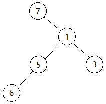

# 最优二叉树

## 题目描述

小团有一个由$N$个节点组成的二叉树，每个节点有一个权值。定义二叉树每条边的开销为其两端节点权值的乘积，二叉树的总开销即每条边的开销之和。小团按照二叉树的中序遍历依次记录下每个节点的权值，即他记录下了$N$个数，第$i$个数表示位于中序遍历第$i$个位置的节点的权值。之后由于某种原因，小团遗忘了二叉树的具体结构。在所有可能的二叉树中，总开销最小的二叉树被称为最优二叉树。现在，小团请小美求出最优二叉树的总开销。

**输入描述**
```
第一行输入一个整数N（1<=N<=300），表示二叉树的节点数。
第二行输入N个由空格隔开的整数，表示按中序遍历记录下的各个节点的权值，所有权值均为不超过1000的正整数。
```

**输出描述**
```
输出一个整数，表示最优二叉树的总开销。
```

### 示例1

**输入**
```
5
7 6 5 1 3
```

**输出**
```
45
```

**说明**

```
最优二叉树如图所示，总开销为7*1+6*5+5*1+1*3=45。
```

## 解释说明

我们使用动态规划解决这个问题。

首先，根节点可以是```arr[i] (0 <= i < N)```，其中为每个根节点计算左侧和右侧的值。

```
#include <iostream>
#include <vector>
#include <cstring>
using namespace std;

static constexpr int MAXLEN = 310;

int dp[MAXLEN][MAXLEN][MAXLEN];
int arr[MAXLEN];

int calcCost(int left, int right, int root) {
    if (left > right) {
        return 0;
    }

    if (root >= 0 && dp[left][right][root] != -1) {
        return dp[left][right][root];
    }

    int cost = INT32_MAX;
    int leftCost = 0, rightCost = 0;
    for (int idx = left; idx <= right; idx++) {
        leftCost = calcCost(left, idx - 1, idx);
        rightCost = calcCost(idx + 1, right, idx);
        cost = min(cost, leftCost + rightCost + arr[idx] * (root == -1 ? 0 : arr[root]));
    }
    dp[left][right][root] = cost;
    return cost;
}

int main(int argc, char** argv) {
    int n = 0;
    cin >> n;
    memset(arr, 0, sizeof(arr));
    memset(dp, -1, sizeof(dp));
    for (int idx = 0; idx < n; idx++) {
        cin >> arr[idx];
    }
    cout << calcCost(0, n - 1, -1) << endl;
}
```