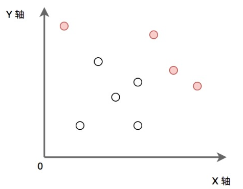

# 最大点数量

## 题目描述

$P$为给定的二维平面整数点集。定义$P$中某点$x$，如果$x$满足$P$中任意点都不在$x$的右上方区域内（横纵坐标都大于$x$），则称其为“最大的”。求出所有“最大的”点的集合。（所有点的横坐标和纵坐标都不重复, 坐标轴范围在$[0, 1e^9)$内）

如下图：实心点为满足条件的点的集合。请实现代码找到集合$P$中的所有“最大”点的集合并输出。



**输入描述**
```
第一行输入点集的个数 N， 接下来 N 行，每行两个数字代表点的 X 轴和 Y 轴。
对于 50%的数据,  1 <= N <= 10000;
对于 100%的数据, 1 <= N <= 500000;
```

**输出描述**
```
输出“最大的” 点集合， 按照 X 轴从小到大的方式输出，每行两个数字分别代表点的 X 轴和 Y轴。
```

### 示例1

**输入**
```
5
1 2
5 3
4 6
7 5
9 0
```

**输出**
```
4 6
7 5
9 0
```

## 解释说明

按照$y$值从大到小排序，然后扫描，保存当前最大的$x$，如果该点比$x$大，那么该点满足条件。

```C++
#include <iostream>
#include <vector>
#include <algorithm>
#include <queue>
using namespace std;

struct Point2i {
    int x = 0, y = 0;
    Point2i(int _x, int _y) : x(_x), y(_y) {}
    Point2i(const Point2i& p) {
        x = p.x;
        y = p.y;
    }
};

int main(int argc, char** argv) {

    int n = 0;
    cin >> n;
    vector<Point2i> arr;
    int x = 0, y = 0;
    for (int idx = 0; idx < n; idx++) {
        cin >> x >> y;
        arr.push_back(Point2i(x, y));
    }

    sort(arr.begin(), arr.end(), [](const Point2i& a, const Point2i& b) {
        return a.y > b.y;
    });

    int maxX = -1;
    for (int idx = 0; idx < n; idx++) {
        if (arr[idx].x > maxX) {
            maxX = arr[idx].x;
            cout << arr[idx].x << " " << arr[idx].y << "\n";
        }
    }
    return 0;
}
```