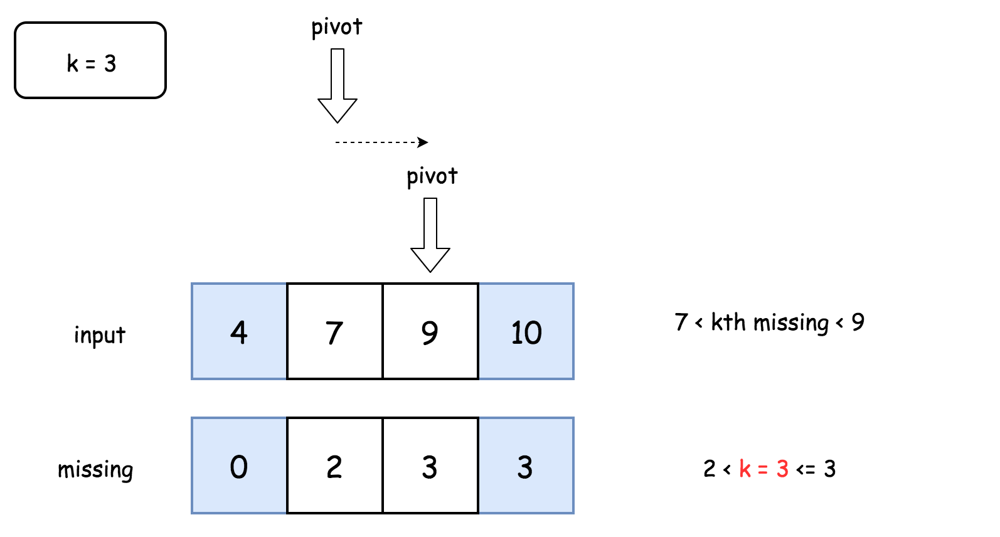

# 有序数组中的缺失元素

## 问题描述

现有一个按**升序**排列的整数数组```nums```，其中每个数字都**互不相同**。

给你一个整数```k```，请你找出并返回从数组最左边开始的第```k```个缺失数字。

### 示例1

**输入**

```
nums = [4, 7, 9, 10], k = 1
```
**输出**
```
5
```
**解释**
```
第一个缺失数字为 5 。
```

### 示例2

**输入**

```
nums = [4, 7, 9, 10], k = 3
```
**输出**
```
8
```
**解释**
```
缺失数字有 [5, 6, 8, ...]，因此第三个缺失数字为 8 。
```

### 示例1

**输入**

```
nums = [1, 2, 4], k = 3
```
**输出**
```
6
```
**解释**
```
缺失数字有 [3, 5, 6, 7, ...]，因此第三个缺失数字为 6 。
```

**备注**
- $1 \leq nums.length \leq 5 \times 10^4$
- $1 \leq nums[i] \leq 10^7$
- $nums$ 按**升序**排列，其中所有元素互不相同 。
- $1 \leq k \leq 10^8$


## 解释说明

由于```missing(idx)```是单调不减的，我们可以通过二分查找的方法找到满足条件的```idx```，并将时间复杂度降低到$O(\log N)$。



```C++
class Solution {
public:
    int missing(vector<int>& arr, int idx) {
        return arr[idx] - arr[0] - idx;
    }
    int missingElement(vector<int>& nums, int k) {
        int low = 0, high = nums.size() - 1, mid = 0, v = 0;
        if (k > missing(nums, high)) {
            return nums[high] + k - missing(nums, high);
        }
        while (high != low) {
            mid = (low + high) >> 1;
            v = missing(nums, mid);
            if (v >= k) {
                high = mid;
            }
            else {
                low = mid + 1;
            }
        }
        return nums[low - 1] + k - missing(nums, low - 1);
    }
};
```