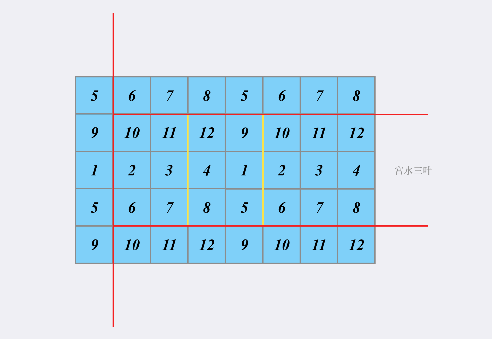

# 矩形区域不超过$K$的最大数值和

## 题目描述

给你一个$m \times n$的矩阵```matrix```和一个整数$k$，找出并返回矩阵内部矩形区域的不超过$k$的最大数值和。

### 示例

```
示例1：matrix = [[1, 0, 1], [0, -2, 3]], k = 2
输出：2

示例2：matrix = [[2, 2, -1]], k = 3
输出：3
```

**提示**
- ```m == matrix.length```
- ```n == matrix[i].length```
- ```1 <= m, n <= 100```
- ```-100 <= matrix[i][j] <= 100```
- $-10^5 \leq k \leq 10^5$

## 解释说明

**朴素二维前缀和**的解法是通过枚举“左上角”&“右下角”来唯一确定某个矩阵。换句话说是通过枚举$(i, j)$和$(p, q)$来唯一确定子矩阵的四个表，每个坐标点可以看做确定子矩阵的某条边。我们可以确定三条边（红色）之后，形成的子矩阵就单纯取决于第四条边的位置（黄色）。

于是，问题转化为**如何快速求得第四条边（黄色）的位置在哪**。
```C++
class Solution {
public:
    int maxSumSubmatrix(vector<vector<int>>& matrix, int k) {

        int m = matrix.size(), n = matrix[0].size();
        vector<vector<int>> sumMatrix(m + 1, vector<int>(n + 1, 0));

        for (int i = 1; i <= m; i++) {
            for (int j = 1; j <= n; j++) {
                sumMatrix[i][j] = sumMatrix[i - 1][j] + sumMatrix[i][j - 1] + matrix[i - 1][j - 1] - sumMatrix[i - 1][j - 1];
            }
        }

        int ans = INT32_MIN;
        for (int top = 1; top <= m; top++) {

            for (int bottom = top; bottom <= m; bottom++) {

                set<int> findLeft;
                findLeft.insert(0);

                for (int r = 1; r <= n; r++) {

                    int right = sumMatrix[bottom][r] - sumMatrix[top - 1][r];
                    auto left = findLeft.lower_bound(right - k);
                    if (left != findLeft.end()) {
                        int cur = right - *left;
                        ans = max(ans, cur);
                    }
                    findLeft.insert(right);
                }

            }
        }
        return ans;
    }
};
```