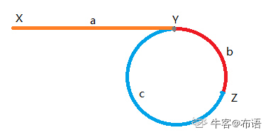

# 链表中环的入口节点

## 题目描述

对于一个给定的链表，返回环的入口节点，如果没有环，返回null

**拓展**：

你能给出不利用额外空间的解法么？

## 说明

首先利用快慢指针找到相遇点，然后将慢指针移到起点，快指针移到相遇点。两个指针以相同的速度移动，然后相同的点就是环中的入口节点。




**原理说明**：假设$Z$表示相遇点，$(a + b) = a + (b + c) \times (n) + b$。同时因为$s_{fast} = 2 \times s_{slow}$，所以$2 \times (a + b) = a + (b + c) \times (n) + b$。进而$a = (n - 1) \times (b) + (n) \times (c) = (n - 1) \times (b + c) + c$。
所以$a$是若干个$b + c$和$c$。

```C++
/**
 * Definition for singly-linked list.
 * struct ListNode {
 *     int val;
 *     ListNode *next;
 *     ListNode(int x) : val(x), next(NULL) {}
 * };
 */
class Solution {
public:
    ListNode *detectCycle(ListNode *head) {
        ListNode *slow = head, *fast = head;
        if (fast->next == nullptr || slow == nullptr){
            return nullptr;
        }
        while(fast && fast->next){
            slow = slow->next;
            fast = fast->next->next;
            if (slow == fast){
                break;
            }
        }
        if (slow != fast){
            return nullptr;
        }
        
        fast = head;
        while(slow != fast){
            slow = slow->next;
            fast = fast->next;
        }
        return slow;
    }
};
```
